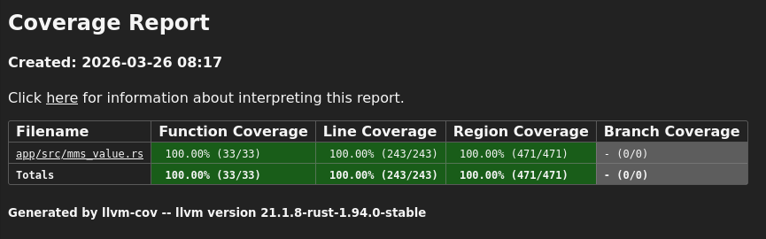

# Prototype: `MmsValue` Rust Migration

This repository contains a focused Rust prototype of the `MmsValue` data structure from the IEC 61850 MMS implementation.
The goal is to explore how core parts of the API can be migrated from C to Rust while improving safety, clarity, and testability.

## Implemented Functionality

The following functions have been reimplemented with equivalent behavior:

- `MmsValue_equals`
- `MmsValue_getType`
- `MmsValue_equalTypes`
- `MmsValue_update`
- `MmsValue_newIntegerFromInt32`
- `MmsValue_setInt32`
- `MmsValue_toInt32`
- `MmsValue_newIntegerFromUint32`
- `MmsValue_setUint32`
- `MmsValue_toUint32`
- `MmsValue_newBoolean`
- `MmsValue_setBoolean`
- `MmsValue_getBoolean`

These cover a subset of:
- CRUD (create, read, update, delete)
- type inspection
- comparison

## Data Model

While the original C implementation relies on tagged unions and manual memory management,
this prototype replaces that with a Rust-native design,
where type representation is explicit
and ownership and memory safety are enforced directly by the compiler.

Currently supported variants:
- Boolean
- Integer
- Unsigned

## Scope and Simplifications

This is a focused prototype, not a full implementation.

Key simplifications:

- Integer handling is value-based (`i64` and `u64`), instead of BER-encoded buffers
- No FFI layer is implemented
- Only a subset of `MmsValue` variants is included

These decisions were made to:

- isolate the implemented functions
- validate the migration pattern
- reduce complexity while preserving overall behaviour

## Testing

Unit Tests are provided to showcase the design's testability.

